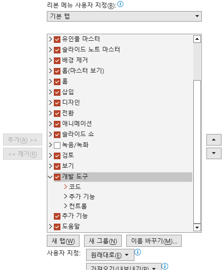
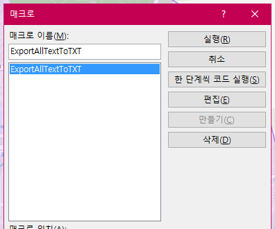

# pptx to txt 로 변환하는 방법

## 순서

1) ppt 파일을 `다른이름으로 저장` 하여 `.pptm` 파일로 저장한다
2) `파일 - 옵션 - 보안센터 - 보안센터 설정 - 신뢰할수 있는 위치` 에 현재 위치를 추가한다
	- 기본적으로 모든 매크로 제외 설정되어 있어, 파일 열때마다 매크로 미포함 문구가 뜬다
	- 이를 제거하기 위함
2) `Alt + F11` 을 눌러 VBA 창을 연다
3) `삽입 - 모듈` 을 눌러 새 모듈을 만든다
4) 아래의 VBA 코드를 작성한다
```vb
// vb treesitter가 highlight 지원이 안돼서 cpp로 설정. 주석은 '로 시작한다
Sub ExportAllTextToMD_UTF8()

    Dim oSlide As Slide
    Dim oShape As Shape
    Dim FilePath As String
    Dim FileNameWithoutExt As String

    ' 1. 파일 이름 및 경로 설정
    FileNameWithoutExt = Left(ActivePresentation.Name, InStrRev(ActivePresentation.Name, ".") - 1) ' 확장자 제거된 ppt 파일 이름
    FilePath = ActivePresentation.Path & "\" & FileNameWithoutExt & ".md" ' .md파일 경로 설정

    ' ADODB.Stream 개체 선언 (utf-8 encoding으로 파일 열기 위함)
    ' (참조 설정: Late Binding 방식 선언으로 Microsoft ActiveX Data Objects 2.x Library 불필요)
    Dim objStream As Object
    Set objStream = CreateObject("ADODB.Stream")
    objStream.Type = 2          ' adTypeText (텍스트 모드)
    objStream.Charset = "utf-8" ' 인코딩을 UTF-8로 명시적 지정
    objStream.Open              ' 파일 열기

    ' .md파일 제목 작성
    objStream.WriteText "# " & FileNameWithoutExt & vbLf
    objStream.WriteText vbLf  ' new line 추가

    ' 슬라이드 순회하여 텍스트 추출
    Dim TextBoxNum As Integer  ' 텍스트박스 번호 변수 추가
    For Each oSlide In ActivePresentation.Slides

        ' 슬라이드 제목 (H2) 작성
        objStream.WriteText "## Slide " & oSlide.SlideIndex & vbLf
        objStream.WriteText vbLf

        TextBoxNum = 0  ' 각 슬라이드마다 텍스트박스 번호 초기화
        For Each oShape In oSlide.Shapes    ' 슬라이드 내 요소 순회
            If oShape.HasTextFrame Then
                If oShape.TextFrame.HasText Then
                    TextBoxNum = TextBoxNum + 1  ' 텍스트박스 번호 증가

                    Dim para As Object
                    Dim textRange As Object
                    Dim processedText As String
                    Dim lineText As String
                    Dim indentLevel As Long
                    Dim bulletChar As String

                    ' 각 텍스트 박스 번호 표시 작성
                    objStream.WriteText "<!-- TextBox " & TextBoxNum & " -->"
                    objStream.WriteText vbLf

                    ' 각 단락(paragraph)을 순회하며 들여쓰기와 글머리 기호 처리
                    For Each para In oShape.TextFrame.textRange.Paragraphs
                        If Len(Trim(para.Text)) > 0 Then
                            Set textRange = para
                            lineText = textRange.Text

                            ' 줄바꿈 문자 정리
                            lineText = Replace(lineText, vbCrLf, "")
                            lineText = Replace(lineText, vbCr, "") ' ^M ->비어 있음
                            lineText = Replace(lineText, vbLf, "")
                            lineText = Replace(lineText, vbVerticalTab, " ")  ' ^K → 공백

                            ' 들여쓰기 레벨 계산 (IndentLevel: 0=첫번째, 1=두번째, ...)
                            indentLevel = textRange.indentLevel - 1
                            If indentLevel < 0 Then indentLevel = 0

                            ' 글머리 기호 처리
                            Set pf = textRange.ParagraphFormat
                            bulletChar = ""
                            If pf.Bullet.Visible Then
                                Select Case pf.Bullet.Type
                                Case ppBulletNumbered       ' 숫자 리스트인 경우, 1),2) 와 같이 작성
                                    bulletChar = CStr(pf.Bullet.Number) & ") "
                                Case Else                   ' 문자 리스트인 경우, indent 에 따라 다르게 작성 (md파일용)
                                    If indentLevel = 0 Then
                                        bulletChar = "* "
                                    Else
                                        bulletChar = "- "
                                    End If
                                End Select
                            End If

                            ' 탭으로 들여쓰기 적용
                            Dim indentSpaces As String
                            indentSpaces = String(indentLevel, vbTab)

                            ' 최종 텍스트 작성
                            processedText = indentSpaces & bulletChar & lineText
                            objStream.WriteText processedText & vbLf
                        End If

                    Next para ' for문 닫기, 다음 단락
                    objStream.WriteText vbLf
                End If
            End If

        Next oShape ' for문 닫기, 다음 슬라이드 요소 확인
        objStream.WriteText vbLf & vbLf

    Next oSlide ' for문 닫기, 다음 슬라이드

    ' 4. 파일 저장 및 닫기
    objStream.SaveToFile FilePath, 2 ' 2 = adSaveCreateOverWrite (덮어쓰기), 같은 이름의 ,md파일이 있으면 덮어씌운다
    objStream.Close ' 파일 객체 닫기.
    Set objStream = Nothing '메모리에서 객체 해제(누수 방지)

    MsgBox FilePath & " 에 추출 텍스트 저장 (UTF-8 encoding)"
End Sub
```

4) `파일 - 옵션 - 리본사용자 지정`
   오른쪽에 `개발 도구`가 체크해제 되어 있으면 체크 한다
	
5) `메뉴 - 개발도구 - 매크로` 선택해 매크로 창을 연다
	
	사용하려는 함수를 누르고 `실행` 한다


## 설명
아래는 기본 vba 코드이다
```cpp
Sub ExportAllTextToTXT()
	Dim oSlide As Slide
	Dim oShape As Shape
	Dim FilePath As String
	Dim FileNumber As Integer
	FilePath = ActivePresentation.Path & "\AllText.txt"
	FileNumber = FreeFile
	Open FilePath For Output As #FileNumber

	For Each oSlide In ActivePresentation.Slides
		Print #FileNumber, "Slide " & oSlide.SlideIndex
		For Each oShape In oSlide.Shapes
			If oShape.HasTextFrame Then
				If oShape.TextFrame.HasText Then
					Print #FileNumber, oShape.TextFrame.TextRange.Text
				End If
			End If
		Next oShape
		Print #FileNumber, "----------------------"
	Next oSlide

	Close #FileNumber
	MsgBox "텍스트가 " & FilePath & " 에 저장되었습니다."
End Sub
```

* `Sub ExportAllTextToTXT()`
	- 매크로 함수이며, 여기서 작성한 이름이 매크로 함수명이 되어 매크로 창에서 보인다

* `Dim ~ as ...`
	- `oSlide` : 각 슬라이드 반복 시 사용할 slide 개체 변수
		- `Dim oSlide As Slide` 는 `oSlide`라는 변수를 선언하며, 여기에 `Slide` 타입 개체만 담을 수 있다는 것
		- `Dim` : 변수선언 시 사용하는 키워드
		- `oSlide` : 슬라이드 개체 참조하는데 관례상 object 변수 앞에 o를 붙인다
		- `Slide` : `int`같은 자료형을 말한다. 데이터 타입
	- `oShape` : 각 슬라이드 내 텍스트 상자 도형을 반복하는데 사용하는 개체 변수
	- `FilePath` : 저장될 파일 경로, 이름 변수 선언
	- `FileNumber` : 파일 번호 저장 정수 변수 선언

* `FilePath = ActivePresentation.Path & \AllText.txt`
	- `ActivePresentation.Path` : 현재 열려 있는 프레젠테이선 파일의 폴더 경로
	- 뒤에 `AllText.txt` 를 붙여, 텍스트 추출 후 저장할 파일의 경로를 설정한다
	- 만들어지는 파일이 ppt 파일명을 따르도록 하려면, 아래와 같이 파일명에서 확장자 제거한 이름을 붙이면 된다
	  ```vb
	  FileNameWithoutExt = Left(ActivePresentation.Name, InStrRev(ActivePresentation.Name, ".") - 1)
	  FilePath = ActivePresentation.Path & "\" & FileNameWithoutExt & ".md"
	  ```

* `FileNumber = FreeFile` : 사용가능한 파일 번호를 시스템에서 할당 받음

* `Open FilePath For Output As #FileNumber`
	- 앞에서 만든 txt 파일 `FilePath`를 열고, `Output` mode로 사용한다. 이는 쓰기 모드
	- 이 파일에 `FileNumber`를 부여한다. = 파일이 이미 존재하면 덮어쓴다
	- 열려진 파일에 접근(read/write)을 위한 파일 번호를 부여하는 것

* `For Each oSlide In ActivePresentation.Slides`
	- 현재 ppt의 _모든 슬라이드를 순서대로 반복하도록 루프 지정_

* `Print #FileNumber, "Slide " & oSlide.SlideIndex`
	- txt 파일에 현재 슬라이드 번호를 작성하기 위함
	- 각 슬라이드마다 추출한 텍스트 파일을 작성할건데, **Slide 1**과 같이 작성된다
	- `Print #FileNumber`는 특정 파일을 지정하여 여기에 데이터를 쓰라는 것
	  파일 입출력 과정의 일부, 파일 번호로 이미 open으로 열어둔 파일을 지정한다
	- &으로 글자를 붙이는 것

* `For Each oShape In oSlide.Shapes`
	- 현재 슬라이드의 _모든 shape 을 순서대로 반복하도록 루프 지정_

* 텍스트 파일 추출
	- VB에서도 한 줄로 And연산 지원하여 논리문을 작성할수는 있다
	- 그러나 VB에서 기본적으로 **단축 평가 지원 안함**. 따라서 항상 두 조건을 모두 검사하므로
	  HasTextFrame이 없는상황에서 HasText에 접근하면 오류가 날 수 있다
	- 따라서 아래와 같이 작성하는것이 최선
	```cpp
	If oShape.HasTextFrame Then // 현재 도형이 텍스트상자인지 확인
		If oShape.TextFrame.HasText Then // 텍스트 상자에 텍스트가 있는지 확인
			Print #FileNumber, oShape.TextFrame.TextRange.Text // 텍스트 내용을 출력
		End If
	End If
	```

* `Next oShape`
	- 다음 슬라이드로 넘어간다

### 인코딩 변환 문제

- `Open FilePath`, `Print` 이용한 텍스트 파일 작성은 Windows에서 기본적으로 `cp949` 인코딩 작성
- **utf-8로 변경하기 위해, `ADODB` 객체를 사용해야 한다**

- 단, 이 객체를 사용하기 위해서는 2가지 방식이 있다
	1) **Early Binding**
		```cpp
		Dim objStream As ADODB.Stream
		Set objStream = New ADODB.Stream
		```
		- `Alt-F11`을 눌러 매크로 편집기를 연 후 `도구 - 참조 - Microsoft ActiveX Data Objects 6.1 Library`를 체크
		- [x] 컴파일 타입 오류 검사
		- [x] 인텔리센스 작동 가능
		- [x] 더 빠른 성능
	2) **Late Binding**
		```cpp
		Dim objStream As Object
		Set objStream = CreateObject("ADODB.Stream")
		```
		- `도구 - ActiveX Library` 참조 설정 불필요
		- [ ] 컴파일 타입 오류 검사 (런타임 시에만 오류 발견 가능)
		- [ ] 인텔리센스 미작동

	3) 여기서는 `2) Late Binding` 방법을 사용하여 굳이 참조 없이 사용하도록 코드 작성

* utf-8 인코딩으로 파일 열기

```cpp
Dim objStream As Object
Set objStream = CreateObject("ADODB.Stream")
objStream.Type = 2 // text mode 로 열기
objStream.Charset = "utf-8"
objStream.Open // 파일 열기
```

* 이후부터는 `Print`가 아니라 `objStream.WriteText` 로 출력하여 작성한다

### ^M, ^K 문제

* 텍스트 박스 안에 있는 문자열은 `oShape.TextFrame.TextRange.Text` 로 접근가능
* 기본적으로 windows 는 crlf를 사용하여 줄바꿈을 한다
	- `^M` : crlf중 carriage return 문자. 텍스트 박스에서 enter를 눌러 줄바꿀 할때 발생
	- `^K` : 텍스트 박스에서 enter로 줄바꿈 하지는 않았지만, 텍스트 박스 열 크기에 의해 강제로 wrapping되어 줄바꿈 된 경우

* 위 문자들이 neovim에서 제대로 표시되도록 하기 위해, 바꿔줘야 한다
```cpp
OldText = oShape.TextFrame.TextRange.Text
NewText = Replace(OldText, vbCrLf, vbLf)
NewText = Replace(NewText, vbCr, vbLf)
NewText = Replace(NewText, vbVerticalTab, " ")
```

